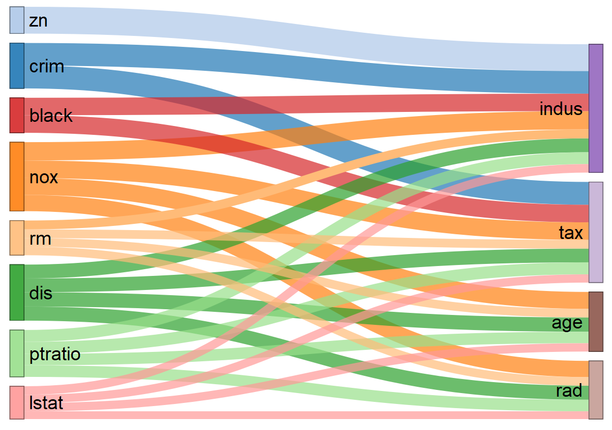

```{r setup, include=FALSE}

knitr::opts_chunk$set(
  collapse = TRUE,
  comment = "#>",
  message = FALSE
)

set.seed(777)
require(glmnet)
require(AlternateLassoR)
# data preparation
data("Boston", package = "MASS")
boston.sc <- scale(Boston)
X <- boston.sc[, -14]
y <- boston.sc[, 14]

# estimate best lambda of lasso based on cross-validation
lasso.cv <- cv.glmnet(X, y)

lasso.cv %>% str
```

# Overview

an implementation to R-package of for the alternate features search proposed in the following paper.

* [S. Hara, T. Maehara, Finding Alternate Features in Lasso, arXiv:1611.05940, 2016.](https://arxiv.org/abs/1611.05940)

* Complete and original Python code is available from [author's github](https://github.com/sato9hara/LassoVariants)

```{r abstract, eval=FALSE}
# fit Alternate Lasso model
lasso.cv <- glmnet::cv.glmnet(X, y)
alt1 <- AlternateLasso(X, y, model = lasso.cv$glmnet.fit, rho = lasso.cv$lambda.1se, verbose = FALSE)

plot(alt1, fontSize = 20)

```


# Detail

## Installation

You can install the **AlternateLassoR** package from [GitHub](https://github.com/katokohaku/AlternateLassoR).

```{r eval=FALSE}
install.packages("devtools") # if you have not installed "devtools" package
devtools::install_github("hoxo-m/pforeach") # if you have not installed "pforeach" package
devtools::install_github("katokohaku/AlternateLassoR")
```

The source code for **AlternateLassoR** package is available on GitHub at
- https://github.com/katokohaku/AlternateLassoR.

## Examples
### Data preparation

In this regression example, [The Boston Housing Dataset](https://www.cs.toronto.edu/~delve/data/boston/bostonDetail.html) is used. This data set is included in MASS pachage.
It is necessary to **standardize variables (scaling)** before using Lasso Regression because of constraints on the size of the coefficients associated to each variable, such as: 
$L(\beta):=\|X\beta - y\|^2+\lambda\|\beta\|_1$ .

```{r dataPrep}
set.seed(1)
require(tidyverse)
require(AlternateLassoR)

data("Boston", package = "MASS")
boston.sc <- scale(Boston)
X <- boston.sc[, -14]
y <- boston.sc[, 14]

```

### choose lambda of lasso based on cross-validation

In this example, `lambda.1se` is used instead of `lambda.min`, which gives **[the most regularized model](https://web.stanford.edu/~hastie/glmnet/glmnet_alpha.html)** such that error is within one standard error of the minimum, to preserve more alternative variables. 

```{r learnModel}
require(glmnet)
lasso.cv <- cv.glmnet(X, y)

plot(lasso.cv$glmnet.fit, xvar = "lambda")
abline(v=log(lasso.cv$lambda.1se), col="red", lty=2, lwd=3)
abline(v=log(lasso.cv$lambda.min), col="grey", lty=3)

```

This case, there are 4 potential alternatives (eliminated variables by lasso) 
```{r}
coef.cv.glmnet(lasso.cv, s="lambda.1se")
```

### fit Alternate Lasso model

Currently this package provides **only linear regression**. For classification tasks with logistic regression, refer to [the python code on author's github](https://github.com/sato9hara/LassoVariants/tree/master/AlternateLasso) of the original article.

```{r predict}
alt1 <- AlternateLasso(X, y, model = lasso.cv$glmnet.fit, rho = lasso.cv$lambda.1se)
summary(alt1)

```

### Visualize 
`plots()` represents the connections from $\mathrm{var_{original}}$ (left side) to $\mathrm{var_{alternative}}$ (right side) and thier intensity (i.e. $score$ in original paper). Each width of flow corresponds to each score and is displayed as the logarithm of the inverse of its score: $\log_{10}(1 + 1/\mathrm{abs}(score))$. 

A wider connection with an alternative indicates that the effect of variable replacement by the alternative could be less severe.

```{r plot, eval=FALSE}
plot(alt1, fontSize = 20)
```


