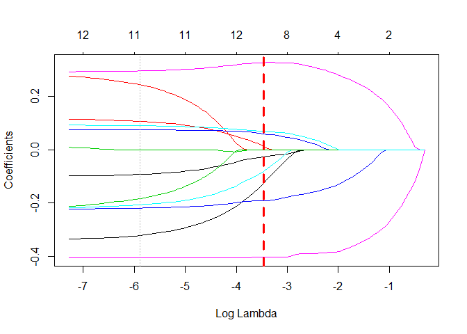

# Overview

an implementation to R-package of for the alternate features search proposed in the following paper.

* [S. Hara, T. Maehara, Finding Alternate Features in Lasso, arXiv:1611.05940, 2016.](https://arxiv.org/abs/1611.05940)

* Complete and original Python code is available from [author's github](https://github.com/sato9hara/LassoVariants)


```r
# fit Alternate Lasso model
lasso.cv <- glmnet::cv.glmnet(X, y)
alt1 <- AlternateLasso(X, y, model = lasso.cv$glmnet.fit, rho = lasso.cv$lambda.1se, verbose = FALSE)

plot(alt1, fontSize = 20)
```

<!--html_preserve--><div id="htmlwidget-28082f302b348f14b357" style="width:672px;height:480px;" class="sankeyNetwork html-widget"></div>
<script type="application/json" data-for="htmlwidget-28082f302b348f14b357">{"x":{"links":{"source":[0,0,1,1,2,2,2,2,3,3,3,3,4,4,4,4,5,5,5,5,6,6,6,7,7,7,7],"target":[8,9,8,9,8,10,11,9,8,10,11,9,8,10,11,9,8,10,11,9,8,10,9,8,10,11,9],"value":[3.39043849121547,3.42517576424932,3.73167154847506,3.64845581609519,2.71532720246811,2.51329164717844,2.38154790705197,2.57924712046444,1.36750116459316,1.31506040908686,1.30353417024728,1.3342045248933,2.03595345768881,2.1020522212793,2.06266135664804,1.99958962776767,1.80693730455535,1.75500921419773,1.76827318261436,1.83344056518307,2.65865486297552,2.61054400692535,2.6752215031321,1.30431407038096,1.2737767368561,1.18700621998697,1.2589748481274],"group":["crim","crim","zn","zn","nox","nox","nox","nox","rm","rm","rm","rm","dis","dis","dis","dis","ptratio","ptratio","ptratio","ptratio","black","black","black","lstat","lstat","lstat","lstat"]},"nodes":{"name":["crim","zn","nox","rm","dis","ptratio","black","lstat","indus","tax","age","rad"],"group":["crim","zn","nox","rm","dis","ptratio","black","lstat","indus","tax","age","rad"]},"options":{"NodeID":"name","NodeGroup":"name","LinkGroup":"feature","colourScale":"d3.scaleOrdinal(d3.schemeCategory20);","fontSize":20,"fontFamily":null,"nodeWidth":15,"nodePadding":10,"units":"","margin":{"top":null,"right":null,"bottom":null,"left":null},"iterations":32,"sinksRight":true}},"evals":[],"jsHooks":[]}</script><!--/html_preserve-->


# Detail

## Installation

You can install the **AlternateLassoR** package from [GitHub](https://github.com/katokohaku/AlternateLassoR).


```r
install.packages("devtools") # if you have not installed "devtools" package
devtools::install_github("hoxo-m/pforeach") # if you have not installed "pforeach" package
devtools::install_github("katokohaku/AlternateLassoR")
```

The source code for **AlternateLassoR** package is available on GitHub at
- https://github.com/katokohaku/AlternateLassoR.

## Examples
### Data preparation

In this regression example, [The Boston Housing Dataset](https://www.cs.toronto.edu/~delve/data/boston/bostonDetail.html) is used. This data set is included in MASS pachage.
It is necessary to **standardize variables (scaling)** before using Lasso Regression because of constraints on the size of the coefficients associated to each variable, such as: 
$L(\beta):=\|X\beta - y\|^2+\lambda\|\beta\|_1$ .


```r
set.seed(1)
require(tidyverse)
require(AlternateLassoR)

data("Boston", package = "MASS")
boston.sc <- scale(Boston)
X <- boston.sc[, -14]
y <- boston.sc[, 14]
```

### choose lambda of lasso based on cross-validation

In this example, `lambda.1se` is used instead of `lambda.min`, which gives **[the most regularized model](https://web.stanford.edu/~hastie/glmnet/glmnet_alpha.html)** such that error is within one standard error of the minimum, to preserve more alternative variables. 


```r
require(glmnet)
lasso.cv <- cv.glmnet(X, y)

plot(lasso.cv$glmnet.fit, xvar = "lambda")
abline(v=log(lasso.cv$lambda.1se), col="red", lty=2, lwd=3)
abline(v=log(lasso.cv$lambda.min), col="grey", lty=3)
```

<!-- -->

This case, there are 4 potential alternatives (eliminated variables by lasso) 

```r
coef.cv.glmnet(lasso.cv, s="lambda.1se")
#> 14 x 1 sparse Matrix of class "dgCMatrix"
#>                         1
#> (Intercept) -4.204596e-16
#> crim        -2.766405e-02
#> zn           1.297615e-02
#> indus        .           
#> chas         5.988494e-02
#> nox         -8.162333e-02
#> rm           3.255561e-01
#> age          .           
#> dis         -1.266486e-01
#> rad          .           
#> tax          .           
#> ptratio     -1.914584e-01
#> black        6.906986e-02
#> lstat       -4.032580e-01
```

### fit Alternate Lasso model

Currently this package provides **only linear regression**. For classification tasks with logistic regression, refer to [the python code on author's github](https://github.com/sato9hara/LassoVariants/tree/master/AlternateLasso) of the original article.


```r
alt1 <- AlternateLasso(X, y, model = lasso.cv$glmnet.fit, rho = lasso.cv$lambda.1se)
#> [ crim ] has [ 2 ] alternatives
#> [ zn ] has [ 1 ] alternatives
#> [ chas ] has [ 0 ] alternatives
#> [ nox ] has [ 4 ] alternatives
#> [ rm ] has [ 4 ] alternatives
#> [ dis ] has [ 4 ] alternatives
#> [ ptratio ] has [ 4 ] alternatives
#> [ black ] has [ 2 ] alternatives
#> [ lstat ] has [ 4 ] alternatives
summary(alt1)
#>       feature   coef                 
#>  [1,] "crim"    "-0.0276640467240226"
#>  [2,] "zn"      "0.0129761499075482" 
#>  [3,] "indus"   "0"                  
#>  [4,] "chas"    "0.0598849402283941" 
#>  [5,] "nox"     "-0.0816233281893132"
#>  [6,] "rm"      "0.325556124390274"  
#>  [7,] "age"     "0"                  
#>  [8,] "dis"     "-0.126648590185123" 
#>  [9,] "rad"     "0"                  
#> [10,] "tax"     "0"                  
#> [11,] "ptratio" "-0.191458375701974" 
#> [12,] "black"   "0.0690698582439022" 
#> [13,] "lstat"   "-0.403257998979111" 
#> Feature: [ crim ], Coef. = -0.027664, Aiternative: 2
#> 	 Alternate Feature: indus, 	Coef. = -0.007646, Score = 0.000352
#> 	 Alternate Feature: tax, 	Coef. = -0.011056, Score = 0.000320
#> Feature: [ zn ], Coef. = 0.012976, Aiternative: 1
#> 	 Alternate Feature: indus, 	Coef. = -0.003325, Score = 0.000079
#> Feature: [ chas ], Coef. = 0.059885, Aiternative: 0
#> 	 ** No Alternate Features **
#> 
#> 
#> Feature: [ nox ], Coef. = -0.081623, Aiternative: 4
#> 	 Alternate Feature: indus, 	Coef. = -0.058730, Score = 0.001597
#> 	 Alternate Feature: age, 	Coef. = -0.038397, Score = 0.002583
#> 	 Alternate Feature: rad, 	Coef. = -0.006190, Score = 0.003299
#> 	 Alternate Feature: tax, 	Coef. = -0.049461, Score = 0.002098
#> Feature: [ rm ], Coef. = 0.325556, Aiternative: 4
#> 	 Alternate Feature: indus, 	Coef. = -0.123911, Score = 0.045192
#> 	 Alternate Feature: age, 	Coef. = -0.056912, Score = 0.051238
#> 	 Alternate Feature: rad, 	Coef. = -0.024599, Score = 0.052552
#> 	 Alternate Feature: tax, 	Coef. = -0.090012, Score = 0.048811
#> Feature: [ dis ], Coef. = -0.126649, Aiternative: 4
#> 	 Alternate Feature: indus, 	Coef. = 0.030816, Score = 0.007536
#> 	 Alternate Feature: age, 	Coef. = 0.053569, Score = 0.006578
#> 	 Alternate Feature: rad, 	Coef. = 0.043900, Score = 0.007048
#> 	 Alternate Feature: tax, 	Coef. = 0.010294, Score = 0.007957
#> Feature: [ ptratio ], Coef. = -0.191458, Aiternative: 4
#> 	 Alternate Feature: indus, 	Coef. = -0.069774, Score = 0.015847
#> 	 Alternate Feature: age, 	Coef. = -0.028761, Score = 0.017863
#> 	 Alternate Feature: rad, 	Coef. = -0.045261, Score = 0.017254
#> 	 Alternate Feature: tax, 	Coef. = -0.083168, Score = 0.014824
#> Feature: [ black ], Coef. = 0.069070, Aiternative: 2
#> 	 Alternate Feature: indus, 	Coef. = -0.021054, Score = 0.002154
#> 	 Alternate Feature: tax, 	Coef. = -0.025450, Score = 0.002052
#> Feature: [ lstat ], Coef. = -0.403258, Aiternative: 4
#> 	 Alternate Feature: indus, 	Coef. = -0.239885, Score = 0.052420
#> 	 Alternate Feature: age, 	Coef. = -0.221590, Score = 0.056633
#> 	 Alternate Feature: rad, 	Coef. = -0.153345, Score = 0.069401
#> 	 Alternate Feature: tax, 	Coef. = -0.214304, Score = 0.058218
```

### Visualize 
`plots()` represents the connections from $\mathrm{var_{original}}$ (left side) to $\mathrm{var_{alternative}}$ (right side) and thier intensity (i.e. $score$ in original paper). Each width of flow corresponds to each score and is displayed as the logarithm of the inverse of its score: $\log_{10}(1 + 1/\mathrm{abs}(score))$. A wider connection with an alternative indicates that the effect of variable replacement by the alternative could be less severe.


```r
plot(alt1, fontSize = 20)
```

<!--html_preserve--><div id="htmlwidget-dd46050412b8de106cc0" style="width:672px;height:480px;" class="sankeyNetwork html-widget"></div>
<script type="application/json" data-for="htmlwidget-dd46050412b8de106cc0">{"x":{"links":{"source":[0,0,1,2,2,2,2,3,3,3,3,4,4,4,4,5,5,5,5,6,6,7,7,7,7],"target":[8,9,8,8,10,11,9,8,10,11,9,8,10,11,9,8,10,11,9,8,9,8,10,11,9],"value":[3.45379568060442,3.49495452656465,4.10482590753442,2.79731347124814,2.5890376540387,2.48300316096832,2.67916527013561,1.36413252912561,1.31211148258727,1.30165435227959,1.33218073575504,2.12611271357815,2.1847536725827,2.15496646440805,2.10268664331173,1.80689364520621,1.75573143608361,1.77054718615441,1.83541737174951,2.66761589712431,2.68863707356127,1.30269346098149,1.27085550161875,1.18777296027801,1.25952010512974],"group":["crim","crim","zn","nox","nox","nox","nox","rm","rm","rm","rm","dis","dis","dis","dis","ptratio","ptratio","ptratio","ptratio","black","black","lstat","lstat","lstat","lstat"]},"nodes":{"name":["crim","zn","nox","rm","dis","ptratio","black","lstat","indus","tax","age","rad"],"group":["crim","zn","nox","rm","dis","ptratio","black","lstat","indus","tax","age","rad"]},"options":{"NodeID":"name","NodeGroup":"name","LinkGroup":"feature","colourScale":"d3.scaleOrdinal(d3.schemeCategory20);","fontSize":20,"fontFamily":null,"nodeWidth":15,"nodePadding":10,"units":"","margin":{"top":null,"right":null,"bottom":null,"left":null},"iterations":32,"sinksRight":true}},"evals":[],"jsHooks":[]}</script><!--/html_preserve-->

